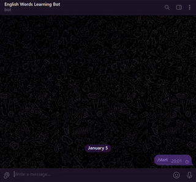

# English Learning Bot

Telegram бот для изучения английских слов на Kotlin.
Бот позволяет изучать слова, отслеживать прогресс пользователей и взаимодействовать с ними через Telegram с использованием подсказок и изображений.

## 🛠️ Стек технологий
1. Kotlin — основной язык разработки
2. Telegram Bot API — взаимодействие с пользователями
3. Git – контроль версий.
4. HTTP и JSON – взаимодействие с внешними сервисами и обработки данных.
5. Kotlinx.Serialization – сериализация данных и подготовка к многопользовательскому режиму.
6. SQLite – хранение пользователей и статистики.
7. GitHub Actions – CI/CD, автоматическая сборка и деплой.

### ✅ Реализованный функционал:
#### 1. CI/CD и деплой
- Настроен автоматический деплой через GitHub Actions
- Новая версия бота автоматически собирается и развёртывается при каждом push в репозиторий

#### 2. Работа с базой данных
- Реализовано хранение:
   - данных пользователей
   - статистики изучения слов
- Отказ от хранения данных в файлах в пользу SQLite

#### 3. Unit-тесты
- Добавлены модульные тесты
- Повышено качество кода и надёжность логики бота

#### 4. Загрузка словаря из файла
- Поддерживается загрузка слов из внешнего файла
- Обновление словаря возможно без изменения кода

#### 5. Картинки-подсказки
- Бот может отправлять изображения как визуальные подсказки
- Название изображения соответствует слову для перевода

#### 6. Редактирование сообщений (Replace-text)
- Вместо отправки новых сообщений используется редактирование текущего
- Снижает количество сообщений и улучшает UX

#### 7. Защита от SQL-инъекций
- Строковая конкатенация SQL заменена на параметризованные запросы
- Добавлена:
   - валидация пользовательского ввода
   - логирование подозрительной активности


# 🚀 Варианты публикации

## 1️⃣ Ручной деплой на VPS
Для публикации бота на VPS используется SCP, для запуска – SSH.

### Настройка VPS

1. Создать виртуальный сервер (например на Ubuntu), получить: ip-адрес, пароль для root пользователя
2. Подключиться к серверу по SSH используя команду `ssh root@ip-адрес` (например `ssh root@100.100.100.100`) и ввести
   пароль
3. Обновить установленные пакеты командами `apt update` и `apt upgrade`
4. Установить JDK командой `apt install default-jdk`
5. Убедиться что JDK установлена командой `java --version`

### Публикация и запуск

1. Собрать shadowJar командой `./gradlew shadowJar`
2. Скопировать jar на VPS и одновременно переименовать его в bot.jar: `scp build/libs/WordsTelegramBot-1.0-SNAPSHOT-all.jar
root@100.100.100.100:/root/bot.jar`
3. Скопировать words.txt на VPS: `scp words.txt root@100.100.100.100:/root/words.txt`
4. Подключиться к серверу по SSH используя команду `ssh root@100.100.100.100` и ввести пароль
5. Запустить бота в фоне командой `nohup java -jar bot.jar <ТОКЕН ТЕЛЕГРАМ> &`
6. Проверить работу бота

### Дополнительно
1. Для картинок-подсказок создать папку images рядом с jar-файлом
2. Название картинки должно совпадать со словом для перевода

## 2️⃣ Автоматический деплой через GitHub Actions

Для настройки автоматического запуска приложения и его перезапуска в случае падения или перезагрузки Ubuntu, 
нужно создать systemd unit файл на сервере в папке `/etc/systemd/system/`
1. Войди на сервер по ssh `ssh root@100.100.100.100`
2. Создай новый файл с расширением `.service` в директории `/etc/systemd/system/` на своем сервере. Например, english-learning-bot.service. 
Добавь в него следующее и сохрани:
```
[Unit]
Description=Learn English Telegram Bot
After=network.target

[Service]
Type=simple
WorkingDirectory=/root
ExecStart=/usr/bin/java -jar /root/bot.jar ваш_токен
Restart=always
RestartSec=10

[Install]
WantedBy=multi-user.target
```
3. Активируй сервис:
```
systemctl daemon-reload
systemctl enable english-learning-bot.service
systemctl start english-learning-bot.service
```
Приложение будет автоматически запускаться при старте системы и перезапускаться при падении.

4. Конфигурация для workflow хранится в файле `build_and_publish.yml`
5. Добавь в репозиторий проекта, в разделе Settings → Secrets and variables - три переменные:
- HOST - с ip адресом твоего сервера
- SSH_USER - root
- SSH_PASSWORD - пароль к вашему серверу
6. После создания файла конфигурации и установки секретов, закоммь и запуш изменения в master. 
Перейди в репозиторий на вкладку Actions. Там будет происходить сборка проекта и выгрузка на сервер